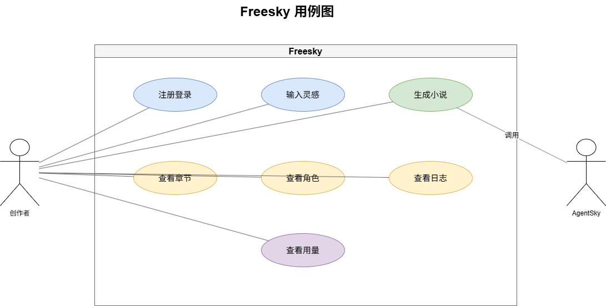
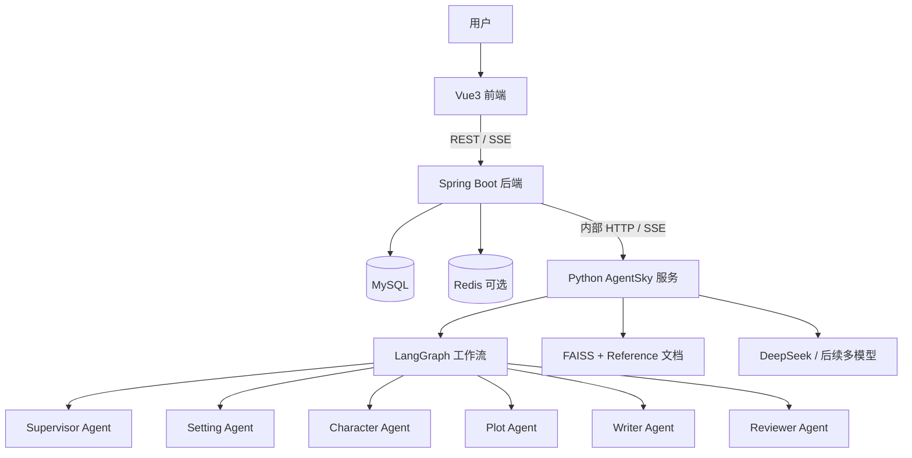
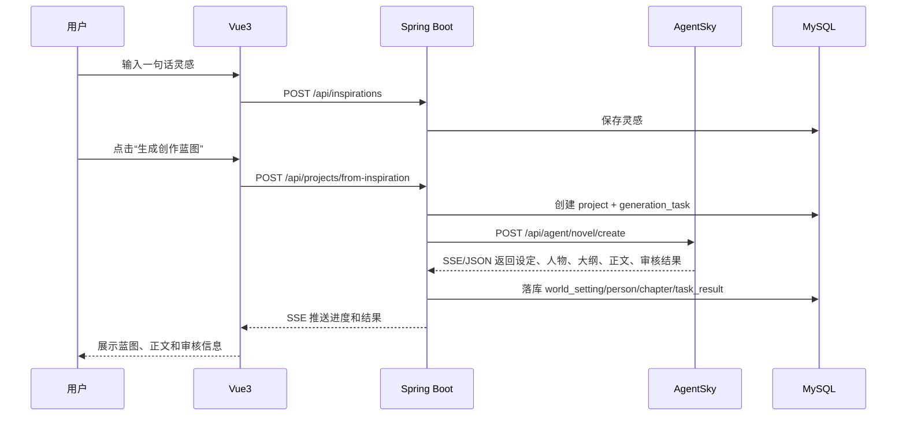
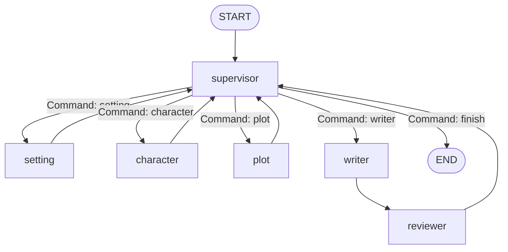
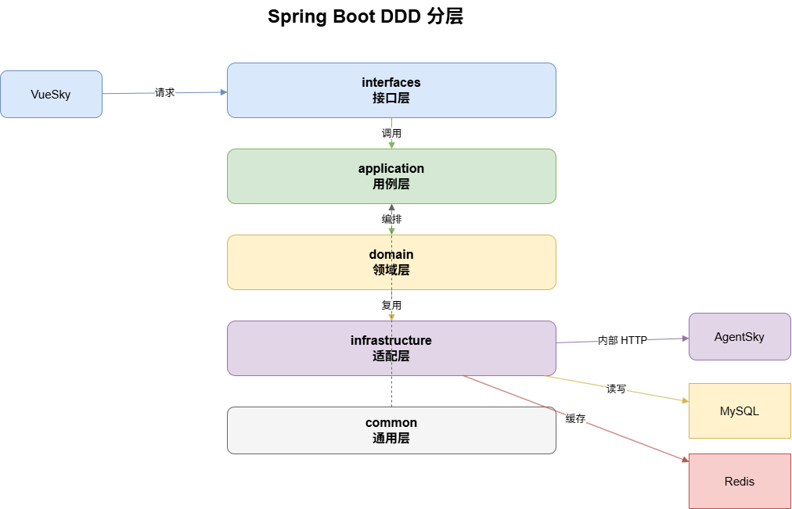

# Freesky 项目设计文档

> Vue3 + Spring Boot + Python LangGraph 的多 Agent 智能小说创作平台设计。

## 0. 设计图索引

`.drawio` 源文件放在 `Design/`，导出的 PNG 建议放在 `Design/pirture/`。

| 图 | 源文件 | 图片占位 |
|---|---|---|
| 系统架构图 | `system-architecture.drawio` | `pirture/system-architecture.drawio.png` |
| 用例图 | `use-case.drawio` | `pirture/use-case.drawio.png` |
| Agent 工作流 | `agent-workflow.drawio` | `pirture/agent-workflow.drawio.png` |
| 生成时序图 | `novel-generation-sequence.drawio` | `pirture/novel-generation-sequence.drawio.png` |
| DDD 分层图 | `springboot-ddd-layers.drawio` | `pirture/springboot-ddd-layers.drawio.png` |
| 数据库 ER 图 | `er-diagram.drawio` | `pirture/er-diagram.drawio.png` |

<!-- 图片占位：导出 system-architecture.drawio 后取消下一行注释 -->
<!--  -->

<!-- 图片占位：导出 use-case.drawio 后取消下一行注释 -->
<!--  -->

## 1. 项目目标

Freesky 面向小说创作者，目标是把“一句话灵感”逐步扩展为可持续创作的长篇小说项目。系统不做一次性聊天生成，而是把写作过程拆成可管理的业务流程：灵感沉淀、项目立项、蓝图生成、逐章写作、审核返工、版本归档。

当前仓库中的 `AgentSky/` 是 Python Agent 服务原型，已经包含 LangGraph 编排、6 个 Agent、DeepSeek 调用、FAISS RAG、FastAPI 接口和基础测试。后续完整平台由三部分组成：

- 前端：Vue3，负责创作工作台、编辑器、任务进度、结果展示。
- 后端：Spring Boot，负责用户、项目、章节、灵感、Skill、权限、数据库和调用编排。
- Agent 服务：Python FastAPI + LangGraph，负责多 Agent 工作流、LLM 调用、RAG 和生成质量审核。

## 2. 总体架构



<!-- 图片占位：导出 system-architecture.drawio 后取消下一行注释 -->
<!--  -->

### 2.1 分层职责

| 层 | 职责 | 不负责 |
|---|---|---|
| Vue3 前端 | 用户交互、工作台、编辑器、任务状态展示、SSE 消息渲染 | 直接调 LLM、保存敏感密钥 |
| Spring Boot 后端 | 业务 CRUD、鉴权、数据库事务、任务管理、调用 Python Agent、结果落库 | Agent 内部推理、Prompt 编排 |
| Python AgentSky | LangGraph 编排、LLM 调用、RAG 检索、JSON 结构化生成、审核闭环 | 用户鉴权、业务主数据持久化 |
| MySQL | 用户、项目、章节、人物、世界观、灵感、Skill、任务记录 | 向量检索 |
| Redis 可选 | 任务进度缓存、SSE 会话状态、限流、临时锁 | 核心业务真相数据 |

核心边界：Java 是业务事实源，Python 是生成能力服务。Python 可以返回结构化结果，但不直接写业务库。

## 3. 核心业务流程

### 3.1 从灵感创建小说项目



<!-- 图片占位：导出 novel-generation-sequence.drawio 后取消下一行注释 -->
<!--  -->

推荐把“灵感保存”和“生成任务”拆成两个动作。这样用户可以先管理灵感库，也可以从多个灵感组合创建项目。

### 3.2 蓝图确认与逐章创作

1. 用户输入灵感或选择已有灵感。
2. Spring Boot 创建项目，状态为 `BLUEPRINT_GENERATING`。
3. Spring Boot 调用 AgentSky 生成世界观、人物、大纲。
4. 用户在前端审核蓝图，可以手动编辑，也可以发起“按意见重写蓝图”。
5. 蓝图确认后，项目状态变为 `WRITING_READY`。
6. 用户选择生成第 N 章。
7. AgentSky 基于项目蓝图、前文章节、RAG 和用户补充要求生成正文。
8. Reviewer Agent 进行五维审核。
9. 通过则章节进入 `AI_DRAFT` 或 `REVIEWED` 状态；未通过则进入返工循环。
10. 用户最终手动确认，章节状态变为 `CONFIRMED`。

## 4. AgentSky 工作流设计

当前 `AgentSky/graph/workflow.py` 已采用 LangGraph `StateGraph`。全局状态定义在 `AgentSky/state.py`，核心字段包括：

| 字段 | 说明 |
|---|---|
| `user_request` | 用户原始创作需求 |
| `phase` | 当前流程阶段，如 `init`、`writing`、`review`、`done` |
| `task_context` | Supervisor 分发给下游 Agent 的具体任务 |
| `world_settings` | 世界观、势力、能力规则等设定库 |
| `characters` | 人物卡与关系 |
| `plot_outline` | 章节大纲与剧情节点 |
| `foreshadowing_bank` | 伏笔计划 |
| `current_draft` | 当前章节草稿 |
| `completed_chapters` | 已完成章节正文 |
| `review_issues` | 审核问题 |
| `review_passed` | 本轮审核是否通过 |
| `review_round` | 审核轮次 |
| `max_review_rounds` | 最大返工轮次 |

### 4.1 Agent 职责

| Agent | 职责 | 当前实现 |
|---|---|---|
| `supervisor` | 主编调度，判断下一跳，处理审核返工 | `AgentSky/agents/supervisor.py` |
| `setting` | 生成世界观、势力、能力规则、地理、历史 | `AgentSky/agents/setting.py` |
| `character` | 生成人物卡、动机、关系网、成长弧光 | `AgentSky/agents/character.py` |
| `plot` | 生成章节大纲、伏笔计划、剧情结构 | `AgentSky/agents/plot.py` |
| `writer` | 基于蓝图写正文，支持审核意见修改 | `AgentSky/agents/writer.py` |
| `reviewer` | 五维审核：设定、逻辑、OOC、文笔、需求偏离 | `AgentSky/agents/reviewer.py` |

### 4.2 LangGraph 路由



<!-- 图片占位：导出 agent-workflow.drawio 后取消下一行注释 -->
<!--  -->

设计重点：

- `supervisor` 是唯一流程决策中心。
- `setting`、`character`、`plot` 完成后固定回 `supervisor`。
- `writer` 完成后固定进入 `reviewer`。
- `reviewer` 不直接结束，统一回 `supervisor`，由主编判断继续写、返工或结束。
- `max_review_rounds` 防止无限返工。

## 5. Spring Boot 后端设计

### 5.1 模块划分

建议后端按业务域拆包：

```text
com.freesky
├── auth              # 登录、注册、JWT、权限
├── user              # 用户资料
├── inspiration       # 灵感 CRUD
├── project           # 小说项目
├── chapter           # 卷/章/正文版本
├── blueprint         # 世界观、人物、大纲、伏笔
├── skill             # 写作风格模板
├── agent             # 调用 Python AgentSky 的适配层
├── task              # 生成任务、进度、结果、错误
└── common            # 异常、响应、分页、审计字段
```

<!-- 图片占位：导出 springboot-ddd-layers.drawio 后取消下一行注释 -->
<!--  -->

### 5.2 后端核心服务

| Service | 作用 |
|---|---|
| `InspirationService` | 管理灵感和项目关联 |
| `ProjectService` | 创建项目、状态流转、项目详情聚合 |
| `BlueprintService` | 保存和更新世界观、人物、大纲、伏笔 |
| `ChapterService` | 章节树、正文版本、确认发布 |
| `SkillService` | 管理风格模板 |
| `AgentTaskService` | 创建生成任务、恢复任务、记录进度 |
| `AgentClient` | 封装对 Python 的 HTTP/SSE 调用 |

### 5.3 项目状态

```text
DRAFT                # 项目刚创建
BLUEPRINT_GENERATING # 蓝图生成中
BLUEPRINT_REVIEW     # 蓝图待用户确认
WRITING_READY        # 可开始逐章写作
CHAPTER_GENERATING   # 章节生成中
CHAPTER_REVIEW       # 章节待用户审核
COMPLETED            # 项目完成或阶段完成
FAILED               # 最近一次生成失败
```

### 5.4 生成任务状态

```text
PENDING
RUNNING
STREAMING
SUCCEEDED
FAILED
CANCELED
```

每次调用 AgentSky 都创建一条 `generation_task`。不要只依赖前端连接状态，否则用户刷新页面后无法恢复进度。

## 6. Python Agent 服务接口

当前 `AgentSky/server.py` 已有：

- `GET /api/health`
- `POST /api/create`

完整平台建议升级为内部 Agent API，保留原接口作为调试入口。

### 6.1 生成蓝图

`POST /api/agent/blueprint/generate`

请求：

```json
{
  "task_id": "task_001",
  "project_id": 1001,
  "user_id": 12,
  "idea": "一个被宗门视为废物的少年，意外觉醒仇恨值系统",
  "style_skill": {
    "name": "热血修仙",
    "prompt": "节奏紧凑，冲突强，章末留钩子"
  },
  "reference_scope": ["project", "user_skill", "system_reference"]
}
```

响应：

```json
{
  "success": true,
  "task_id": "task_001",
  "result": {
    "world_settings": [],
    "characters": [],
    "plot_outline": [],
    "foreshadowing_bank": []
  },
  "token_usage": {
    "call_count": 8,
    "input_tokens": 12000,
    "output_tokens": 6000,
    "cost_yuan": 0.024
  }
}
```

### 6.2 生成章节

`POST /api/agent/chapter/generate`

请求：

```json
{
  "task_id": "task_002",
  "project_id": 1001,
  "chapter_id": "ch_01",
  "user_request": "写第一章，突出主角被羞辱后的反击欲望",
  "world_settings": [],
  "characters": [],
  "plot_outline": [],
  "foreshadowing_bank": [],
  "completed_chapters": [],
  "revision_instruction": ""
}
```

响应：

```json
{
  "success": true,
  "task_id": "task_002",
  "result": {
    "chapter_id": "ch_01",
    "chapter_title": "仇火初燃",
    "current_draft": "...",
    "review_passed": true,
    "review_round": 1,
    "review_issues": []
  },
  "token_usage": {}
}
```

### 6.3 SSE 事件

如果要做“生成过程可视化”，Spring Boot 对前端暴露 SSE，Python 可以对 Spring Boot 暴露 SSE 或返回分段事件。建议事件统一为：

```json
{
  "task_id": "task_002",
  "event": "agent_started",
  "agent": "writer",
  "phase": "writing",
  "message": "开始撰写第1章",
  "payload": {},
  "created_at": "2026-08-18T12:00:00+08:00"
}
```

事件类型：

| event | 说明 |
|---|---|
| `task_started` | 任务开始 |
| `agent_started` | 某个 Agent 开始 |
| `agent_log` | Agent 普通日志 |
| `agent_result` | Agent 结构化结果 |
| `review_issue` | 审核发现问题 |
| `token_usage` | Token 消耗更新 |
| `task_succeeded` | 任务成功 |
| `task_failed` | 任务失败 |

## 7. 数据库设计补充

现有 `Design/requirements.md` 已列出 10 张核心表。完整平台建议增加任务和版本相关表。

<!-- 图片占位：导出 er-diagram.drawio 后取消下一行注释 -->
<!--  -->

### 7.1 建议新增表

| 表 | 说明 |
|---|---|
| `generation_task` | 每次 Agent 生成任务 |
| `generation_event` | 生成过程事件日志，用于刷新恢复和审计 |
| `chapter_version` | 章节正文版本，保存 AI 草稿、人工编辑、重写版本 |
| `foreshadowing` | 伏笔表，独立于 plot 存储，支持状态追踪 |
| `project_reference` | 项目级参考资料，如设定集、风格样例 |
| `model_config` | 用户或系统级模型配置，可选 |

### 7.2 关键落库映射

| AgentSky 字段 | MySQL 表 |
|---|---|
| `world_settings` | `world_setting` |
| `characters` | `person` |
| `plot_outline` | `chapter`，其中无正文的节点作为大纲节点 |
| `foreshadowing_bank` | `foreshadowing` |
| `current_draft` | `chapter_version` |
| `completed_chapters` | `chapter_version` / `chapter` |
| `review_issues` | `generation_task.review_summary` 或独立 `review_issue` |
| `token_usage` | `generation_task` |

## 8. 前端页面设计

### 8.1 页面结构

| 页面 | 作用 |
|---|---|
| 登录/注册 | 用户入口 |
| 灵感库 | 管理灵感碎片、标签、搜索、创建项目 |
| 项目列表 | 查看小说项目、状态、最近编辑 |
| 项目工作台 | 聚合蓝图、章节、生成任务 |
| 蓝图编辑页 | 世界观、人物、大纲、伏笔的结构化编辑 |
| 章节编辑器 | AI 生成、人工编辑、重写、版本对比 |
| Skill 模板页 | 管理写作风格 Prompt |
| 任务历史页 | 查看生成记录、失败原因、Token 成本 |

### 8.2 工作台布局建议

```text
┌──────────────────────────────────────────────┐
│ 项目标题 / 状态 / 当前 Skill / 生成按钮       │
├──────────────┬───────────────────────────────┤
│ 左侧导航      │ 主工作区                       │
│ - 灵感        │ - 蓝图卡片 / 章节编辑器         │
│ - 世界观      │ - SSE 生成进度                  │
│ - 人物        │ - 审核问题列表                  │
│ - 大纲        │ - 保存/确认/重写                 │
│ - 章节        │                               │
└──────────────┴───────────────────────────────┘
```

前端不要只显示最终正文。多 Agent 产品的价值在“过程可控”，所以要让用户看到当前正在由哪个 Agent 工作、产出了什么、哪里被 reviewer 打回。

## 9. RAG 与参考资料

当前 `AgentSky/agents/rag.py` 会读取 `AgentSky/data/reference/*.txt`，按中文句子切块，使用 SentenceTransformer 生成向量并写入 FAISS。

后续平台建议分三类参考资料：

| 类型 | 来源 | 用途 |
|---|---|---|
| 系统参考资料 | 后端内置或 Python 本地目录 | 通用写作方法、题材模板 |
| 用户 Skill | MySQL `skill` 表 | 风格、语气、结构偏好 |
| 项目资料 | 用户上传或项目编辑内容 | 世界观设定集、已有正文、人物关系 |

短期实现可以由 Spring Boot 在调用 Python 时直接把相关文本放进请求。中期再做项目级向量库，避免每次请求传输过多上下文。

## 10. 错误处理与安全

### 10.1 生成失败

- Python 返回 `success=false` 时，Spring Boot 记录 `generation_task.error_message`。
- 前端展示可读错误，并允许“重试”。
- JSON 解析失败时，Python Agent 已有 `_call_llm_json` 重试机制；仍失败时应返回空结果和明确错误码。
- 超过 `max_review_rounds` 后由 Supervisor 强制结束，避免任务卡死。

### 10.2 权限与密钥

- DeepSeek API Key 默认放在 Python `.env`，生产环境放入服务器环境变量或密钥管理服务。
- 如果支持用户自带 Key，必须由 Spring Boot 加密存储，Python 只在单次请求中接收临时解密后的 Key。
- 前端永不接触模型 Key。

### 10.3 并发控制

- 同一项目同一章节同时只允许一个生成任务运行。
- `generation_task` 加唯一业务锁：`project_id + target_type + target_id + RUNNING`。
- 用户刷新页面后，通过任务状态和事件日志恢复进度。

## 11. 开发阶段规划

### Phase 1：打通三端最小闭环

目标：Vue3 调 Spring Boot，Spring Boot 调 AgentSky，生成结果落库并展示。

任务：

- 搭建 Spring Boot 项目与 MySQL 基础表。
- 实现用户、项目、灵感、章节的基础 CRUD。
- 封装 `AgentClient` 调用 `AgentSky /api/create`。
- 前端实现灵感输入、生成按钮、结果页。
- 保存 `world_settings`、`characters`、`plot_outline`、`current_draft`。

验收：

- 用户输入一句灵感后，可以在前端看到生成的设定、人物、大纲和第一章正文。
- 生成任务失败可查看错误。
- 刷新页面后结果仍存在。

### Phase 2：蓝图确认与逐章写作

目标：从“一次生成”升级为“用户确认蓝图后逐章创作”。

任务：

- 拆分 Python 接口：蓝图生成、章节生成、章节重写。
- 后端增加项目状态机和生成任务表。
- 前端增加蓝图编辑页和章节编辑器。
- 支持 reviewer 问题展示和一键按意见重写。

验收：

- 用户可编辑蓝图后再生成章节。
- 每章有版本记录。
- 审核问题可以被追踪和重新生成。

### Phase 3：SSE 流式进度

目标：让多 Agent 过程可视化。

任务：

- Python 生成标准事件。
- Spring Boot 转发 SSE 给前端。
- 前端任务面板实时显示 Agent 进度、日志、审核问题和 Token 成本。
- 事件写入 `generation_event`。

验收：

- 用户能看到 supervisor、setting、character、plot、writer、reviewer 的执行顺序。
- 刷新页面后能恢复最近事件。

### Phase 4：RAG 与 Skill 产品化

目标：让用户可控风格和参考资料。

任务：

- Skill 模板 CRUD。
- 项目参考资料上传。
- 调用 Python 时注入 Skill 和参考资料。
- 后续升级为项目级向量库。

验收：

- 同一灵感选择不同 Skill 会生成明显不同风格。
- 项目资料能影响生成结果。

### Phase 5：生产化

目标：可部署、可观测、可恢复。

任务：

- Docker Compose 编排 MySQL、后端、AgentSky。
- 增加日志追踪 ID：`request_id`、`task_id`。
- 增加限流、超时、任务取消。
- 增加单元测试、接口测试和端到端测试。

验收：

- 服务重启后任务和结果不丢。
- 常见失败有明确错误提示。
- 后端和 Python 都有健康检查。

## 12. 当前仓库对齐建议

短期不建议推翻 `AgentSky`。它已经跑通核心 Agent 链路，下一步应围绕它做服务化收口：

1. 保留 `POST /api/create` 作为演示接口。
2. 新增更细粒度的 `blueprint/generate`、`chapter/generate`、`chapter/rewrite`。
3. 把 `AgentSkyState` 作为 Python 内部状态协议，把 HTTP DTO 作为外部协议，二者不要强绑定。
4. Spring Boot 只保存结构化结果，不保存 Python 运行时对象。
5. reviewer 统一回 supervisor 的设计应写入测试，避免测试和源码分叉。

## 13. 推荐下一步

优先实现 Phase 1。不要一开始就做完整 SSE、复杂向量库和多模型配置。先让三端闭环真实跑起来：前端输入、后端建任务、Python 生成、后端落库、前端展示。这个闭环跑通后，后面的蓝图确认、逐章写作、SSE 和 RAG 产品化都会有清晰落点。
