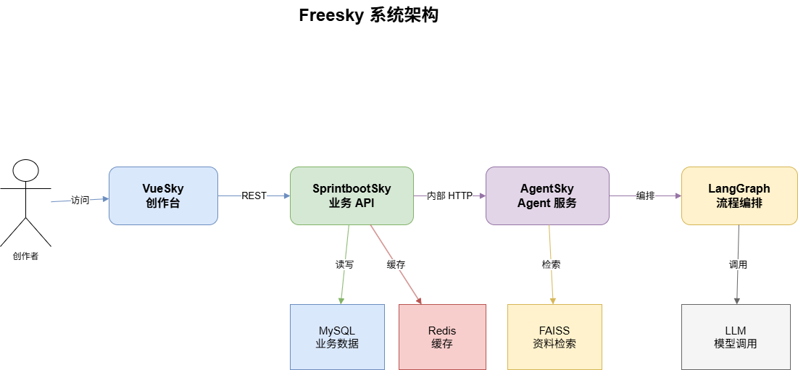
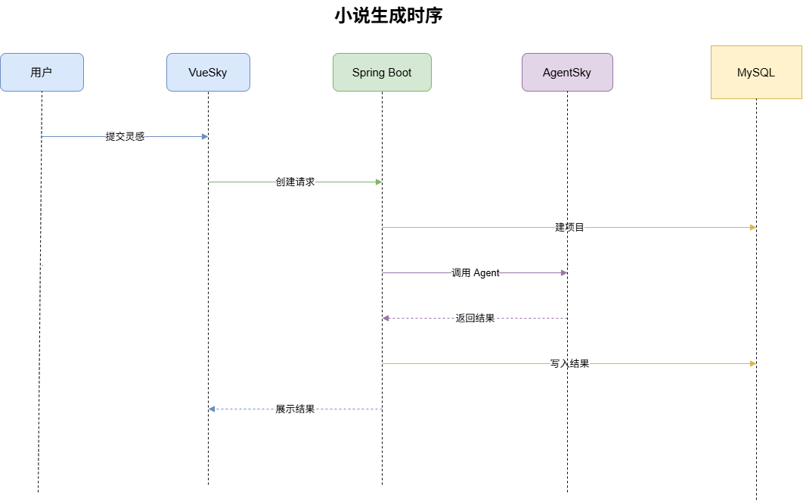
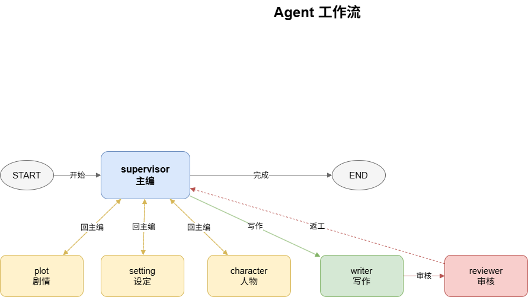
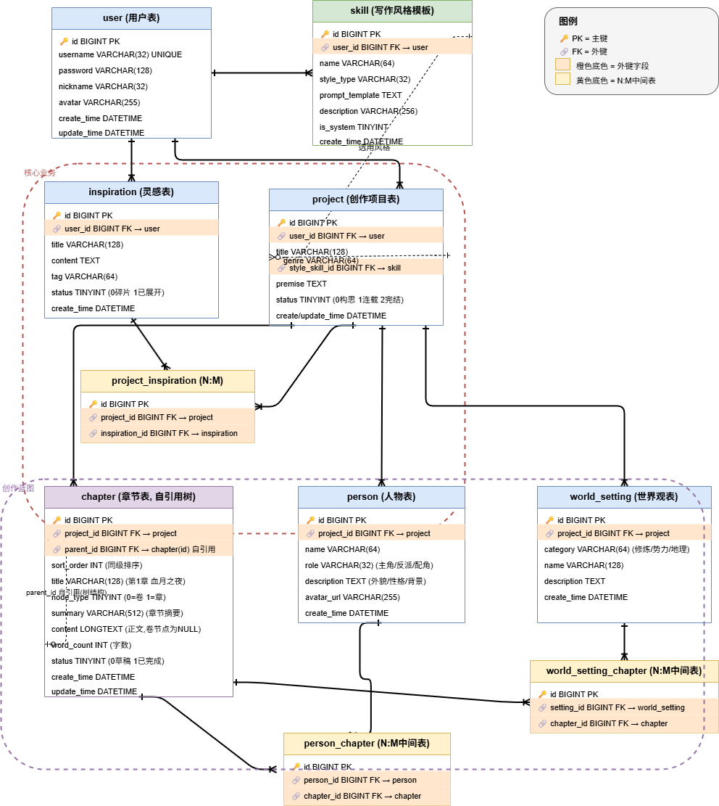

# Freesky

> Freesky 是一个多 Agent 智能小说创作平台：用户输入一句灵感，系统通过前端工作台、Spring Boot 业务服务和 Python LangGraph Agent，把灵感扩展为设定、人物、大纲、正文、审核记录和 Token 用量。

## 开发声明

本项目由 **郑** 借助 **OpenAI Codex** 完成从需求分析、系统设计、前端 Vue、后端 Spring Boot、Python Agent 服务、测试与文档整理的全栈开发。

## 项目状态

当前仓库已形成三端闭环：

| 模块 | 状态 | 说明 |
|---|---|---|
| `VueSky/` | 已接入 | Vue 3 + Vite 创作工作台 |
| `SprintbootSky/` | 已接入 | Java 21 + Spring Boot 业务 API |
| `AgentSky/` | 已接入 | FastAPI + LangGraph 多 Agent |
| `Design/` | 持续更新 | 需求、架构、ER、流程图 |

## 项目预览







## 核心能力

- 用户注册、登录、JWT 鉴权和 `/api/auth/me` 当前用户接口。
- 前端提交灵感，Java 后端创建小说项目并调用 Python Agent。
- Python LangGraph 编排 `supervisor`、`setting`、`character`、`plot`、`writer`、`reviewer` 六个 Agent。
- Reviewer 支持审核闭环，未通过时回到主编调度。
- 数据库设计采用初版 10 表 ER，后续阶段逐步对齐实现。
- AgentSky 支持 FAISS + SentenceTransformer 本地 RAG 资料检索。
- 前端展示章节、角色、运行日志、Token 成本和生成状态。

## 架构概览

```text
用户
  ↓
VueSky 创作工作台
  ↓ REST
SprintbootSky 业务服务
  ├─ MySQL / Flyway
  ├─ Redis
  └─ 内部 HTTP
       ↓
AgentSky 多 Agent 服务
  ├─ LangGraph 工作流
  ├─ FAISS RAG
  └─ DeepSeek / OpenAI 兼容模型
```

## 设计图

`.drawio` 源文件位于 `Design/`，图片导出后建议放到 `Design/pirture/`。

| 图 | 源文件 | 图片占位 |
|---|---|---|
| 系统架构图 | `Design/system-architecture.drawio` | `Design/pirture/system-architecture.drawio.png` |
| 用例图 | `Design/use-case.drawio` | `Design/pirture/use-case.drawio.png` |
| Agent 工作流 | `Design/agent-workflow.drawio` | `Design/pirture/agent-workflow.drawio.png` |
| 生成时序图 | `Design/novel-generation-sequence.drawio` | `Design/pirture/novel-generation-sequence.drawio.png` |
| DDD 分层图 | `Design/springboot-ddd-layers.drawio` | `Design/pirture/springboot-ddd-layers.drawio.png` |
| 数据库 ER 图 | `Design/er-diagram.drawio` | `Design/pirture/er-diagram.drawio.png` |







## 技术栈

| 层 | 技术 | 职责 |
|---|---|---|
| 前端 | Vue 3、Vite、TypeScript、Vitest | 工作台、状态展示、结果阅读 |
| Java 后端 | Java 21、Spring Boot、Spring Security、JWT、Flyway | 鉴权、项目、落库、调用 Agent |
| Python Agent | FastAPI、LangGraph、LangChain | 多 Agent 编排、LLM 调用 |
| RAG | FAISS、SentenceTransformer | 本地参考资料检索 |
| 数据 | MySQL、Redis | 业务数据、缓存 |

## 快速开始

### AgentSky

```bash
cd AgentSky
python -m venv venv
venv\Scripts\activate
pip install -r requirements.txt
copy .env.example .env
python server.py
```

命令行调试：

```bash
cd AgentSky
python main.py "一个被宗门视为废物的少年，意外觉醒仇恨值系统"
```

### SprintbootSky

```bash
cd SprintbootSky
.\mvnw test
.\mvnw spring-boot:run
```

### VueSky

```bash
cd VueSky
pnpm install
pnpm test
pnpm build
pnpm dev
```

## 目录结构

```text
Freesky/
├── AgentSky/        # Python FastAPI + LangGraph Agent 服务
├── SprintbootSky/   # Spring Boot 业务后端
├── VueSky/          # Vue 3 前端工作台
├── Design/          # 需求、设计文档、drawio 源图
├── docs/            # 规格与过程文档
└── study/           # 学习练习
```

## 主要接口

| 服务 | 接口 | 说明 |
|---|---|---|
| Spring Boot | `GET /api/health` | 后端健康检查 |
| Spring Boot | `GET /api/agent/health` | Agent 连通检查 |
| Spring Boot | `POST /api/auth/register` | 注册 |
| Spring Boot | `POST /api/auth/login` | 登录 |
| Spring Boot | `GET /api/auth/me` | 当前用户 |
| Spring Boot | `POST /api/novels` | 创建小说 |
| AgentSky | `GET /api/health` | Agent 健康检查 |
| AgentSky | `POST /api/create` | 生成小说 |

## 测试

```bash
cd AgentSky && pytest
cd SprintbootSky && .\mvnw test
cd VueSky && pnpm test && pnpm build
```

## 相关文档

- `Design/requirements.md`：需求分析。
- `Design/project-design.md`：总体设计。
- `Design/er-diagram.drawio`：数据库 ER 图。
- `docs/superpowers/specs/`：功能规格。
